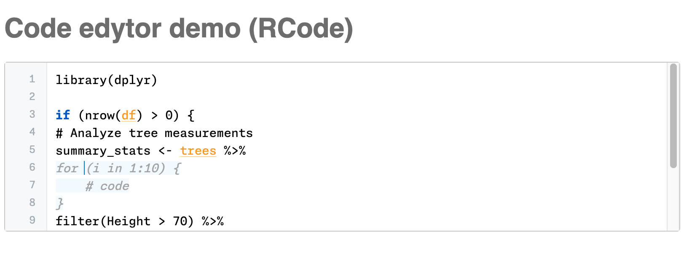

# CodeEdytor 

A simple, lightish weight, language-agnostic code editor component for Svelte with basic code completion, snippets, and syntax highlighting,



## ✨ Features

### **Smart Completions**

- **Ghost text cycling** - Navigate completions with ↑/↓ arrows
- **Context-aware** - Keywords, functions, variables, and snippets

### **Syntax Highlighting**

- **Keywords** in bold blue - language constructs
- **Known variables** in orange with underlines

### **Language Agnostic**

- **Pluggable editor classes** - Pass any language implementation
- **Python, R, and Javascript** support included in the box.
- **Tree-sitter integration** - Robust parsing for syntax analysis
- **Extensible completion system** - Keywords, functions, snippets, variables

## 📚 Documentation

- **[INTERFACES.md](./INTERFACES.md)** - Complete TypeScript interface documentation for external integrators
- **[API Reference](#-api-reference)** - Component props, methods, and usage patterns (below)

## 🚀 Quick Start

```svelte
<script>
	import CodeEdytor from 'code-edytor';
	import { RCodeEdytor } from 'code-edytor/r';
	// and or: import { JSCodeEdytor } from 'code-edytor/r';
	// and or: import { PythonCodeEdytor } from 'code-edytor/r';
</script>

<!-- Basic R editor -->
<CodeEdytor editorClass={RCodeEdytor} initialCode="library(dplyr)" />

<!-- With namespace variables -->
<CodeEdytor
	editorClass={RCodeEdytor}
	availableVariables={['df', 'model', 'results']}
	initialCode=""
/>

<!-- Custom dimensions and fonts-->
<CodeEdytor
	editorClass={RCodeEdytor}
	width="800px"
	height="400px"
	maxHeight="600px"
	font-family="Monaspace Argon Var"
/>
```

(Note: Monaspace Argon Var, Monaspace Neon Var, and FiraCode-VF are packaged and configured in css. You are also welcome to bring your own font.)

## 📖 API Reference

### Props

| Prop                 | Type                      | Default              | Description                                        |
| -------------------- | ------------------------- | -------------------- | -------------------------------------------------- |
| `editorClass`        | `Class`                   | **required**         | Editor class (RCodeEdytor, PythonCodeEdytor, etc.) |
| `initialCode`        | `string`                  | `""`                 | Initial code content                               |
| `availableVariables` | `string[]`                | `[]`                 | Variables in current namespace (reactive)          |
| `onVariableRequest`  | `() => Promise<string[]>` | `null`               | Callback to fetch fresh variables                  |
| `width`              | `string`                  | `"100%"`             | Editor width                                       |
| `height`             | `string`                  | `"200px"`            | Editor height                                      |
| `minHeight`          | `string`                  | `"200px"`            | Minimum height                                     |
| `maxHeight`          | `string`                  | `"200px"`            | Maximum height                                     |
| `maxWidth`           | `string`                  | `"100%"`             | Maximum width                                      |
| `minWidth`           | `string`                  | `"300px"`            | Minimum width                                      |
| `font-family`        | `string`                  | `"Monaspace Neon V"` | Font                                               |
| `oninput`            | `(event) => void`         | `null`               | Callback on every input change                     |
| `onchange`           | `(newCode) => void`       | `null`               | Callback when content changes                      |
| `onblur`             | `(event) => void`         | `null`               | Callback when editor loses focus                   |
| `onfocus`            | `(event) => void`         | `null`               | Callback when editor gains focus                   |
| `value`              | `string`                  | `undefined`          | For two-way binding with `bind:value`              |

### Methods

The component exposes methods for external integration:

| Method                                 | Parameters          | Description                                |
| -------------------------------------- | ------------------- | ------------------------------------------ |
| `updateCode(newCode, preserveCursor?)` | `string`, `boolean` | Update editor content from external source |
| `getCode()`                            | none                | Get current code content                   |

### Real-time Collaboration Example

```svelte
<script>
	import { CodeEdytor, RCodeEdytor } from 'code-edytor';

	let codeEditor;

	// Handle user input for real-time sync
	function handleInput(event) {
		// Send changes to collaboration server
		collaborationClient.sendChange(codeEditor.getCode());
	}

	// Handle incoming changes from other users
	function handleRemoteChange(newCode) {
		codeEditor.updateCode(newCode, true); // preserve cursor
	}
</script>

<CodeEdytor
	bind:this={codeEditor}
	editorClass={RCodeEdytor}
	oninput={handleInput}
	onchange={(code) => console.log('Code changed:', code)}
	onblur={() => console.log('Editor blurred')}
	onfocus={() => console.log('Editor focused')}
/>
```

### Two-way Binding

You can use `bind:value` just like with a textarea:

```svelte
<script>
	import { CodeEdytor, PythonCodeEdytor } from 'code-edytor';

	let code = 'print("Hello World")';
</script>

<!-- Two-way binding -->
<CodeEdytor bind:value={code} editorClass={PythonCodeEdytor} />

<!-- This input will stay in sync with the editor -->
<input bind:value={code} placeholder="Same content as editor" />
```

### Keyboard Shortcuts

| Key     | Action                                      |
| ------- | ------------------------------------------- |
| `Tab`   | Accept completion or insert 4 spaces        |
| `Enter` | Accept completion (when active) or new line |
| `↑`     | Cycle to previous completion                |
| `↓`     | Cycle to next completion                    |
| `Esc`   | Dismiss completions                         |

## 🔌 Creating Language Support

Create your own language editor by extending the base class:

```javascript
import { CodeEdytor } from 'code-edytor/base';

export class PythonCodeEdytor extends CodeEdytor {
	constructor() {
		super('python');
	}

	async makeParser() {
		// Initialize tree-sitter parser for Python
		await Parser.init();
		const parser = new Parser();
		const Python = await Parser.Language.load('/tree-sitter-python.wasm');
		parser.setLanguage(Python);
		return parser;
	}

	getKeywords() {
		return ['def', 'class', 'if', 'else', 'for', 'while', 'import', 'from'];
	}

	getBuiltinFunctions() {
		return {
			print: { description: 'Print to console' },
			len: { description: 'Get length' },
			range: { description: 'Generate range' }
		};
	}
}
```

## 🎨 Customization

### Styling Variables

Override CSS custom properties to match your theme:

```css
:global(.keyword) {
	color: #your-keyword-color;
	font-weight: 700;
}

:global(.known-variable) {
	color: #your-brand-color;
	text-decoration: underline;
	text-decoration-color: rgba(your-brand-rgb, 0.6);
}

.line-numbers-gutter {
	background: #your-gutter-background;
	border-right: 1px solid #your-border-color;
}
```

## 🏢 Use Cases

### Jupyter-like Notebooks

```svelte
<CodeEdytor
	editorClass={RCodeEdytor}
	availableVariables={cellVariables}
	onVariableRequest={async () => await kernel.getVariables()}
/>
```

### Documentation Sites

```svelte
<CodeEdytor
	editorClass={JavaScriptCodeEdytor}
	initialCode={exampleCode}
	height="300px"
	width="100%"
/>
```

### Code Playgrounds

```svelte
<CodeEdytor
	editorClass={SQLCodeEdytor}
	availableVariables={tableNames}
	width="100%"
	maxHeight="80vh"
/>
```

## 🛠️ Development

```sh
# Install dependencies
npm install

# Start development server
npm run dev

# Build library
npm run build

# Run tests
npm test
```

## 📝 License

MIT - see [LICENSE](LICENSE) file for details.

### Font Licenses

This package includes fonts with their own licenses:

- **[Monaspace](https://github.com/githubnext/monaspace)** - SIL Open Font License 1.1 (see [LICENSES/Monaspace-LICENSE.txt](LICENSES/SIL-LICENSE))
- **[Fira Code](https://github.com/tonsky/FiraCode)** - SIL Open Font License 1.1 (see [LICENSES/FiraCode-LICENSE.txt](LICENSES/SIL-LICENSE))

All font files are redistributed in compliance with their respective licenses.

## 🙌 Contributing

Contributions welcome! Feel free to open an issue and/or create a pull request.

---

Built with ❤️ using Svelte, Tree-sitter, and modern web technologies.
